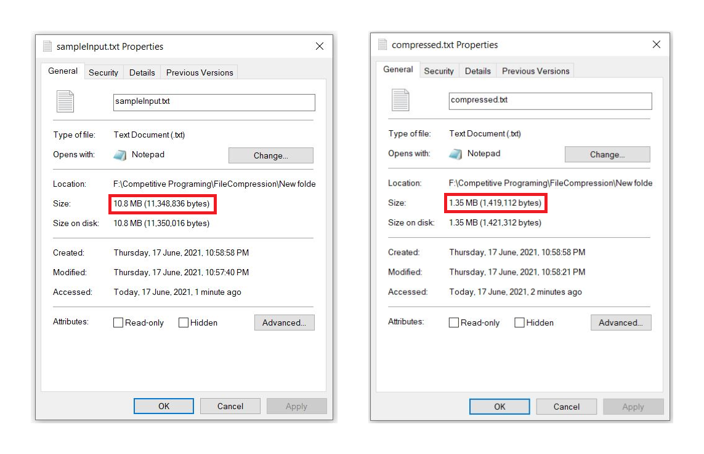

## Running Tests

To run / execute this project : 


Save compress.cpp, decomppress.cpp & sampleInput.txt files in same folder.


To compress the sampleInput.txt file run :
```bash
  g++ compress.cpp
```
After that compressed.txt file will be generated.
  

  To decomppress the file run 

  ```bash
  g++ decompress.cpp
```

You will get the decomppressed.txt file;

## Authors

- [@Nikhil Dabhade](https://www.linkedin.com/in/nikhil-dabhade-1519131a7/)


## Screenshot\

